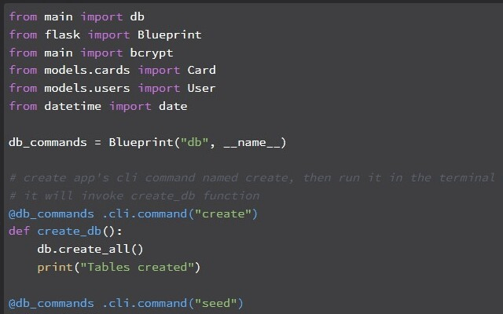
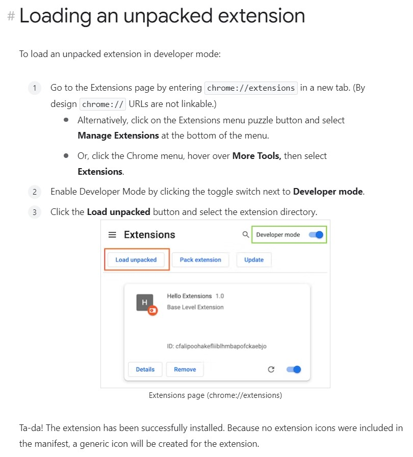

# Syntax Highlighter for Ed

## Installation

- Directly from the [Chrome Web Store page](https://chrome.google.com/webstore/detail/code-syntax-highlighter-f/cmbplgilmheonekccfhdoljbaenlkhff)

- or install locally

	1. Download repository and unzip

	1. Follow these 3 steps to load the unzipped extension folder

	

## Usage

Either use `Alt+H` or click the extension icon in the Chrome Toolbar.

In order for the icon to appear in the Chrome Toolbar, it first needs to be "pinned" by opening the extensions menu (click the puzzle piece icon) and clicking the pin next to **Code Syntax Highlighter for Ed**

## Dependencies

[Highlight.js](https://highlightjs.org/) 